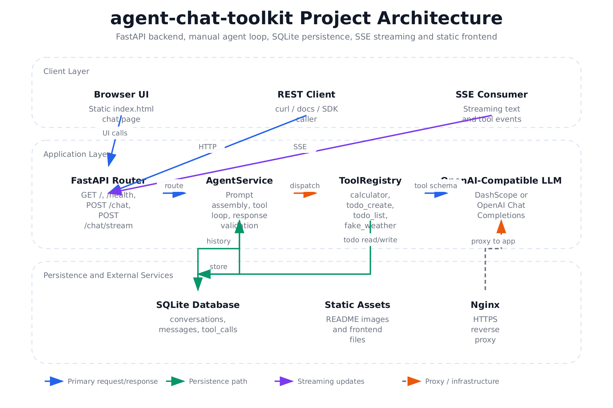
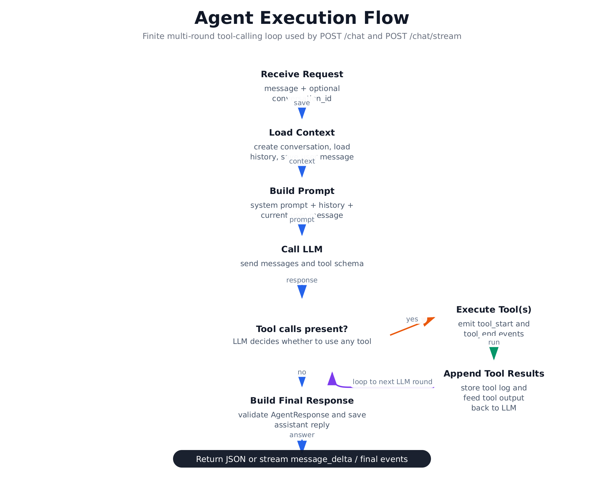
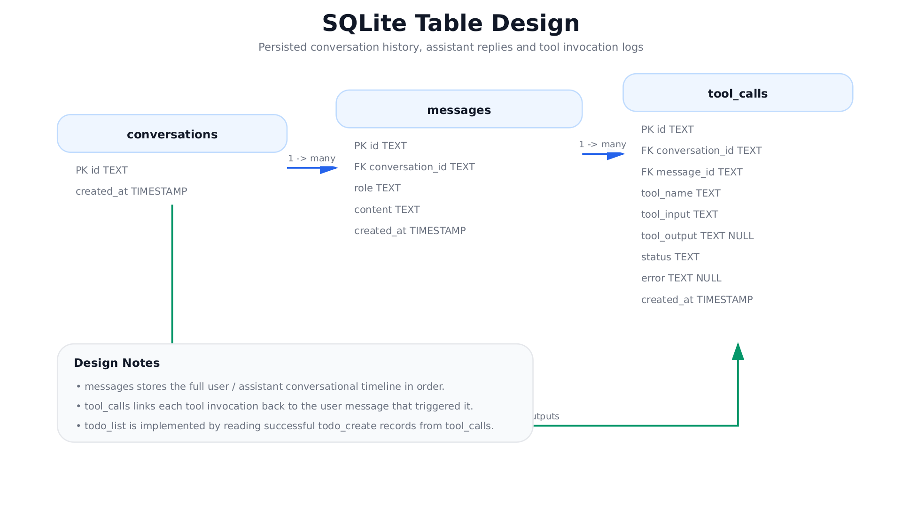
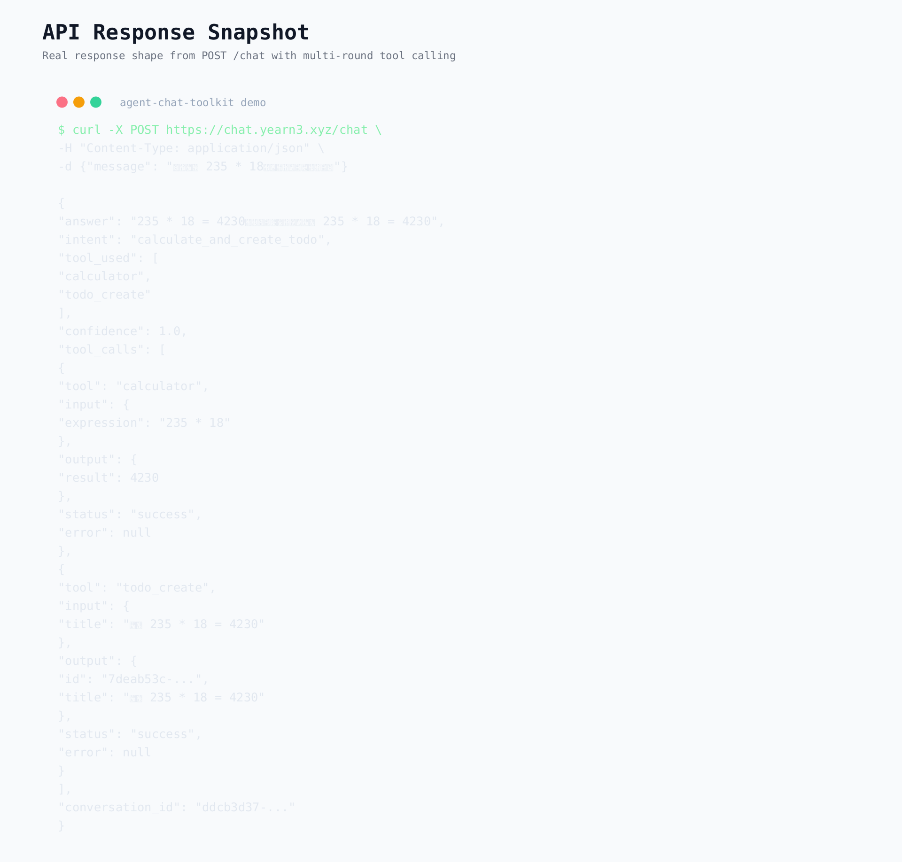
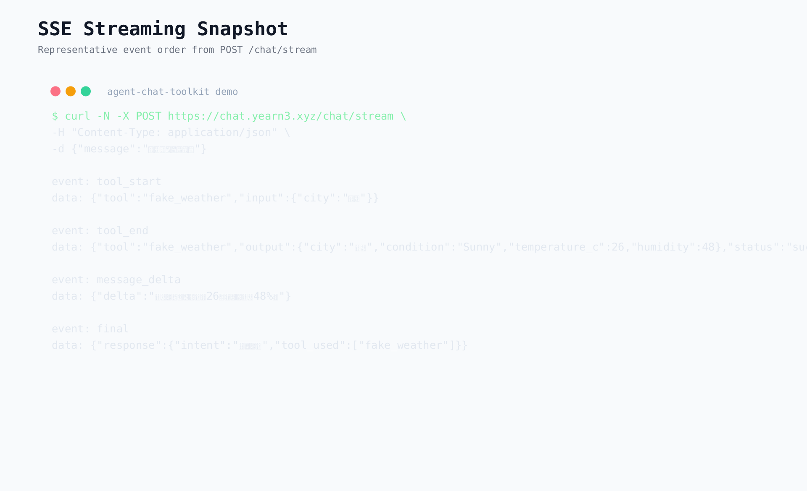

# agent-chat-toolkit

一个最小但完整的 Agent 聊天项目，包含：

- FastAPI 后端
- 手写 tool/function calling 调度层
- SQLite 对话与工具调用记录
- SSE 流式回复接口
- 极简前端聊天页面
- pytest 测试

## 在线访问

- 生产地址：`https://chat.yearn3.xyz/`
- 健康检查：`https://chat.yearn3.xyz/health`
- OpenAPI 文档：`https://chat.yearn3.xyz/docs`

## 功能概览

- `POST /chat`：普通聊天接口
- `POST /chat/stream`：SSE 流式聊天接口
- 4 个内置工具：
  - `calculator`
  - `todo_create`
  - `todo_list`
  - `fake_weather`
- 结构化输出：
  - `answer`
  - `intent`
  - `tool_used`
  - `confidence`
  - `tool_calls`
  - `conversation_id`

## 项目架构图



项目由静态前端、FastAPI 路由层、手写 Agent 编排层、工具注册中心、SQLite 持久化和 OpenAI-compatible 大模型组成。Nginx 负责对外提供 HTTPS 入口，并把流量转发到本地 `uvicorn` 服务。

## Agent 执行流程图



当前实现采用有限多轮 tool-calling：

- 接收请求并加载上下文
- 构造 prompt 与工具 schema
- 调用 LLM 判断是否需要工具
- 如有工具调用，则执行工具、记录日志、把结果回填给 LLM
- 最终校验并返回 `AgentResponse`，或通过 SSE 逐步输出

## 数据库表设计图



SQLite 最少包含 3 张表：

- `conversations`：会话主表
- `messages`：用户与助手消息历史
- `tool_calls`：工具调用输入、输出、状态和错误信息

## 环境准备

- Python 3.10+

## 安装依赖

```bash
python3 -m venv .venv
source .venv/bin/activate
pip install -r requirements.txt
```

## 配置环境变量

复制 `.env.example` 为 `.env`，至少配置：

```bash
cp .env.example .env
```

可用变量：

- `OPENAI_API_KEY`
- `OPENAI_BASE_URL`
- `OPENAI_MODEL`
- `SQLITE_PATH`

如果未配置可用的 LLM 凭证，服务仍能启动，但 `/chat` 和 `/chat/stream` 会返回可控错误。

## 启动服务

```bash
uvicorn app.main:app --reload
```

启动后访问：

- 前端页面：`http://127.0.0.1:8000/`
- OpenAPI 文档：`http://127.0.0.1:8000/docs`
- 如果已经接好 Nginx：`https://chat.yearn3.xyz/`

## 运行测试

```bash
pytest
```

测试使用 fake LLM client，不依赖真实模型调用。

## API 示例

### 普通聊天

```bash
curl -X POST http://127.0.0.1:8000/chat \
  -H "Content-Type: application/json" \
  -d '{
    "message": "帮我计算 235 * 18，然后创建一个待办事项"
  }'
```

示例响应：

```json
{
  "answer": "计算结果是 4230，我已经帮你创建了待办事项。",
  "intent": "calculate_and_create_todo",
  "tool_used": ["calculator", "todo_create"],
  "confidence": 0.92,
  "tool_calls": [
    {
      "tool": "calculator",
      "input": {"expression": "235 * 18"},
      "output": {"result": 4230},
      "status": "success",
      "error": null
    }
  ],
  "conversation_id": "..."
}
```

### API 截图



### 流式聊天

```bash
curl -N -X POST http://127.0.0.1:8000/chat/stream \
  -H "Content-Type: application/json" \
  -d '{
    "message": "北京天气怎么样？"
  }'
```

流式事件类型：

- `message_delta`
- `tool_start`
- `tool_end`
- `final`
- `error`

### SSE 示例截图



## 项目结构

```text
app/
  agent.py
  config.py
  database.py
  llm.py
  main.py
  models.py
  tools.py
  static/index.html
tests/
  test_app.py
data/
docs/images/
```
